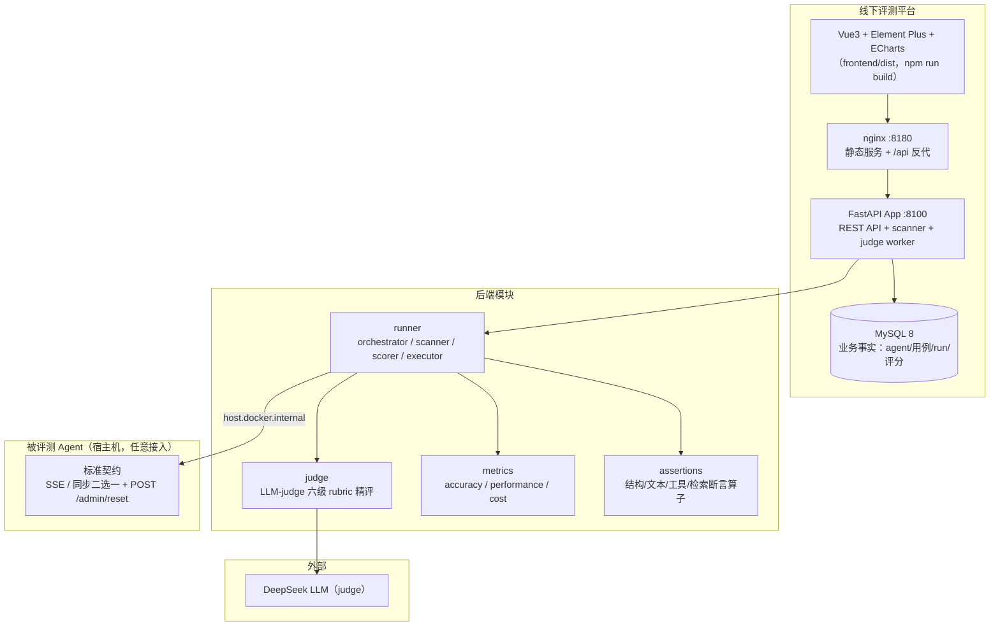

# AI Agent 线下评测平台（agent-evaluation-offline）

> **Agent 提测上线前的线下评测平台**：对任意 agent 的核心 LLM 接口在隔离测试环境做 HTTP 评测，量化**答案准确性 / 性能 / token 成本**三类指标，看板呈现汇总、版本对比、逐层下钻定位问题点。**线下**——评测不与生产流量混跑，用固定用例集 + 契约探测在独立测试环境执行。

本系统是**生产级线下评测平台**：docker-compose 三容器一键启动、强契约驱动任意 agent 接入、规则断言 + LLM-judge 混合评分、门禁墙逐层下钻、PDF 报告导出。

---

> ## ⚠️ 前置依赖：共享 infra
>
> 本 agent **不自带任何中间件**，运行前须先部署共享 infra（MySQL 等）。
>
> ```bash
> # 发布物：clone infra 独立仓库后启动
> git clone https://github.com/zhanggy1984/share-infra && cd infra && docker compose up -d
> # 本地开发：infra 位于 ../infra
> cd ../infra && docker compose up -d
> ```

## 目录

- [一、项目简介：解决什么痛点](#一项目简介解决什么痛点)
- [二、业务价值：给谁带来什么](#二业务价值给谁带来什么)
- [三、技术闪光点](#三技术闪光点)
- [四、系统架构](#四系统架构)
- [五、技术栈一览](#五技术栈一览)
- [六、快速开始（3 步跑起来）](#六快速开始3-步跑起来)
- [七、接入 Agent](#七接入-agent)
- [八、目录结构](#八目录结构)
- [九、测试与验收](#九测试与验收)
- [十、开发指南](#十开发指南)
- [十一、常见问题](#十一常见问题)

---

## 一、项目简介：解决什么痛点

agent 提测上线前，质量缺乏系统化量化与呈现：

- **评分口径不一**：答案「好不好」靠人工抽查，无统一维度、无门禁标准；
- **回归难发现**：改造一次代码，无法快速判断「哪些接口、哪些场景变差了」；
- **性能 / 成本不可见**：首字延迟、端到端耗时、token 消耗无量化，上线前不知道是否达标；
- **问题定位慢**：分数低不知道差在哪——是答案错了、推理缺步、工具调用错，还是接口超时。

本系统针对以上痛点，提供四个核心能力：

| 能力 | 实现 | 对应痛点 |
|------|------|---------|
| **强契约评测** | 跑前契约探测拦截，SSE 变体 / 同步变体两种标准契约，任意 agent 统一标准接入 | 口径不一 |
| **规则 + LLM 混合评分** | 确定性断言扣分 + LLM-judge 六级 rubric 精评（含判定理由） | 回归难发现 |
| **性能 / 成本量化** | 真实 usage 透出 × 模型单价表，TTFT/E2E 的 P50/P95，成本趋势 | 不可见 |
| **逐层下钻定位** | 门禁墙 L0 契约 → L3 用例明细 → L3.5 未达标摘要 → L4 证据级回放 | 定位慢 |

**评测范围**：只评「有 LLM 参与的核心业务接口」；注册/登录/CRUD/健康检查不进评测。

---

## 二、业务价值：给谁带来什么

### 对评测方（QA / 评测工程师）
- **门禁把关**：门禁墙按 agent 汇总通过率与均分，未达标用例一眼可见；
- **证据级回放**：L4 证据含 agent 最终回答、思考链全文、judge 判定理由、断言详情、工具调用、usage/timing，无需复现即可定位问题；
- **报告导出**：run 明细一键导出 PDF，审计留档；token 明文仅返回一次，DB 存 sha256。

### 对 agent 开发方
- **量化得分**：agent_score / 每维度分（完成度/事实性/思考链/工具使用）0-100 制，未达标维度明确列出「低于达标分 70」；
- **judge 判定理由**：每条不达标带 judge 逐维度判定依据，可回灌修 agent，而非一句「分低」；
- **回归对比**：按 run 对比版本得分走势，改造前后一目了然。

### 对管理者
- **看板汇总**：门禁墙 / 评分趋势 / 性能趋势 / 成本趋势四视图；
- **基线对比**：最近 run × 接口 × 维度 vs 达标分，gap 即差距。

---

## 三、技术闪光点

### 1. 强契约驱动 + 平台定标准（agent 只适配，平台零特判）
平台定义标准契约（SSE 变体：`meta`/`usage`/`done` 必选 + `id:` 帧 + data 内 `ts`；同步变体：`usage`/`timing`/`meta`，不验 done），接入方 agent 按标准收敛改造（标准契约 + `POST /admin/reset` 造数重置接口 + 鉴权 env 开关）。**平台侧禁止 `if agent` 特判**——发现/校验只认标准契约信号，契约探测不达标直接拦截报错，保证任意新 agent 接入即用。

### 2. 规则 + LLM-judge 混合评分
- **确定性断言**：结构/文本/工具/检索四类断言算子（白名单插件注册），扣分制不否决，维度内精评；
- **LLM-judge**：语义维度（factuality/reasoning）用六级锚点 rubric（1.0/0.8/0.6/0.4/0.2/0.0）+ 理由，不输出模糊连续分；
- **分数合成**：加权平均 + 每维度阈值门禁（pass/fail），N/A 剔除重归一化，error 率硬门禁。

### 3. 金标准 = 校准集，驱动基线对比
`is_gold` 用例是绝对水平基线：baseline_target 从金标准校准集自动标定（接口 × 维度 vs 达标分），`golden_answer` 同时作为 judge 判分的事实参考。

### 4. run 状态机 + 多 worker 跨进程 DB 化
run 终态由 `scorer` 汇总（`partial_failed` 只认执行/技术 error，`fail` 未达标不改变终态）；scanner 后台心跳租约 + 硬超时回收；跨进程状态全部 DB 化：run 互斥（agent 行 `FOR UPDATE`）、reset(seed) 锁、熔断（`agent_circuit`）、scanner 单例（`GET_LOCK`）——多 worker 部署也不丢状态。

### 5. 门禁墙逐层下钻（L0 → L4）
| 层 | 内容 | 作用 |
|----|------|------|
| L0 | 门禁墙（agent 级汇总） | agent 均分 / 通过率 / 用例数；跑前契约探测不达标 → run 直接 partial_failed（硬拦截） |
| L3 | 用例明细 | 每用例得分 + 每维度分 |
| L3.5 | 未达标摘要 | 未达标用例 + 维度分 < 达标分的逐条判定理由 |
| L4 | 证据回放 | agent 回答 / 思考链 / judge 判定 / 断言 / 工具调用 / usage |

### 6. 插件化评测
维度（completeness/factuality/reasoning/tool_usage + ttft/e2e/cost）、adapter（配置型声明 base_url/接口/reset/conversation_id，通用引擎执行）、rubric、断言算子四者均可插拔——新增评测维度不碰核心代码。

### 7. 成本透明 + 单价可配
agent 透出真实 usage（不估算），× 模型单价表（元/百万 token）算成本；`model-prices` 支持峰谷价（deepseek-chat 空闲 1.5/4.5），成本面板展示趋势 + 明细 + 单价。

### 8. 安全与合规基线
- **RBAC 三角色**：admin / evaluator / viewer + JWT；评测触发需 Staff；
- **SSRF 白名单**：`DEFAULT_AGENT_CIDRS` 代码常量与 DB seed 双处同步，agent 直连仅内网；
- **安全响应头**：CSP 收紧 `default-src 'none'`、`X-Frame-Options: DENY` 等；
- **报告安全**：token 明文仅返一次、DB 存 sha256、PDF 页脚水印；
- **插件白名单**：断言算子 class_path 白名单校验。

### 9. 工程化细节
- 后端容器热挂载源码（改代码 `docker compose restart backend` 即生效，无需 rebuild）；
- 宿主跑 pytest 有环境开关（`RUN_INTEGRATION=1` 才连库，默认 integration 自动 skip）；
- 场景清单由 seed 固化，用例标注（gold / 场景 / 断言）走用例管理页。

---

## 四、系统架构



**关键链路**：触发评测（手动）→ 契约探测（L0 硬拦截）→ 逐 case：reset(seed) 造数归位 → 调用 agent 接口（采集 answer/usage/timing/tool_call）→ 断言 + judge 评分 → scorer 汇总（加权平均 + 维度门禁 + run 终态）→ 门禁墙呈现 + 未达标摘要 → PDF 报告导出。

---

## 五、技术栈一览

| 层 | 技术 | 说明 |
|----|------|------|
| 后端 | Python 3.11 + FastAPI | async/await，单进程 uvicorn（workers=1），scanner/judge 后台协程 |
| ORM/迁移 | SQLAlchemy 2 (async) + Alembic | 异步 ORM，run 快照（case_version 表）保证历史自包含 |
| 前端 | Vue3 + Vite + Element Plus + Pinia + ECharts | 5 个业务页面（看板/配置/Agent/用例/用户），JS 非 TS |
| 数据库 | MySQL 8 | utf8mb4，业务权威数据源 |
| LLM judge | DeepSeek（openai 兼容） | 语义维度六级 rubric 精评 |
| 插件 | 断言算子白名单 + 配置型 adapter | 可插拔评测维度 |
| 测试 | pytest + pytest-asyncio | 单元 / 集成（`RUN_INTEGRATION=1` 连库） |
| 部署 | docker compose | backend + frontend + MySQL 三容器 |

---

## 六、快速开始（3 步跑起来）

> 前置：Docker Desktop（Linux 容器）、Python 3.11。
> **共享 infra**：本 agent 不自带任何中间件（仅依赖共享 infra 的 MySQL）。启动前先部署 infra（见 infra 仓库 README：`docker compose up -d`）。

### 第 1 步：配置环境变量

```bash
cp .env.example .env
# 编辑 .env，至少填入（缺失则启动直接报错）：
#   DB_PASSWORD=xxx        # 共享 infra 的 ai_evaluation 库密码
#   JWT_SECRET=xxx         # ≥256bit（JWT 签名）
#   FERNET_KEYS=xxx        # 逗号分隔多代密钥
# 可选：
#   JUDGE_API_KEY=xxx      # judge LLM API Key（语义维度评分必需）
#   ADMIN_PASSWORD=xxx     # 空库重建 admin 初始密码
```

### 第 2 步：启动应用容器（backend + frontend）

```bash
docker compose up -d --build
# 等待 backend healthy（依赖共享 infra MySQL 就绪）
docker compose ps                 # ai-eval-backend / ai-eval-frontend 全部 Up
curl localhost:8100/healthz       # {"status":"ok"}
```

**平台端口**（宿主侧）：

| 容器 | 宿主端口 | 容器内 |
|------|---------|--------|
| backend | 8100（`APP_HOST_PORT`） | 8000 |
| frontend | 8180（`FRONT_HOST_PORT`） | 80 |

> 本 agent 只起应用容器；MySQL 在共享 infra（库 `ai_evaluation`）。

### 第 3 步：初始化数据（seed 手动执行）

> seed 不会在启动时自动跑，需手动执行一次（幂等 upsert，可重跑）。

```bash
docker compose exec backend python -m app.seed
```

**跑起来了**：

```bash
open http://localhost:8180        # 浏览器前端
```

| 角色 | 账号 | 密码 | 可做什么 |
|------|------|------|---------|
| 管理员 | `admin` | 由 `.env` 的 `ADMIN_PASSWORD` 注入 | 建 agent/接口、改全局配置、管理用户 |
| 评测员 | `evaluator` | seed 演示账号（仅本地评测环境） | 触发评测、标注用例 |
| 查看者 | `viewer` | seed 演示账号（仅本地评测环境） | 只读看板 |

> 触发评测前需确认被评 agent 服务在线（标准契约 + `POST /admin/reset` 就绪），且宿主侧对应端口未被其他服务占用。

---

## 七、接入 Agent

本平台是**公开、统一标准的评测系统**：任何 agent（内部自研或第三方）只要满足平台定义的标准契约即可接入评测，平台对 agent 零特判。接入方 agent 独立部署（各自 docker compose），通过 `host.docker.internal` 被平台访问。

| 接入要求 | 说明 |
|---------|------|
| 标准契约 | SSE 变体（`meta`/`usage`/`done` 必选 + `id:` 帧 + data 内 `ts`）或同步变体（`usage`/`timing`/`meta`，不验 done）二选一 |
| 造数重置 | 提供 `POST /admin/reset`，跑前重置业务数据，保证用例可重复 |
| 鉴权开关 | 评测环境鉴权走 env 开关旁路，方便编排压测 |

> agent 侧契约改造与回归在各 agent 仓库完成，不在本仓库。契约探测不达标 → run 直接 partial_failed（硬拦截），接入即用。

---

## 八、目录结构

```
ai-evaluation/
├── backend/                 # 后端源码（FastAPI）
│   ├── app/
│   │   ├── main.py          # 应用入口（scanner + judge worker 协程）
│   │   ├── api/             # REST 路由（auth/users/agents/cases/runs/dashboard/config/...）
│   │   ├── runner/          # orchestrator / scanner / scorer / executor（评测执行链路）
│   │   ├── judge/           # LLM-judge 六级 rubric 精评
│   │   ├── metrics/         # 维度评分（accuracy/performance/cost 三类）
│   │   ├── assertions/      # 断言算子（结构/文本/工具/检索 + 白名单注册）
│   │   ├── adapters/        # 配置型 adapter（base_url/接口/reset/conversation_id）
│   │   ├── models/          # SQLAlchemy 模型
│   │   └── core/            # 配置/安全(JWT)/错误/审计/探测/限流/重试
│   ├── tests/               # 单元 + 集成（RUN_INTEGRATION=1 连库）
│   ├── alembic/             # 数据库迁移
│   └── requirements.txt
├── frontend/                # 前端（Vue3 + Vite + Element Plus + Pinia）
│   ├── src/
│   │   ├── views/           # Dashboard（性能/成本/覆盖三面板）/Agents/Cases/Config/Users
│   │   ├── api/             # axios 接口模块
│   │   ├── components/      # EChart / TermTip 术语引导
│   │   ├── constants/       # configMeta / terms（配置中心与 seed 双处同步）
│   │   └── utils/           # runFilter / caseParse
│   └── nginx.conf           # 静态服务 + /api 反代
├── uploads/                 # 文件型用例自存文件（宿主 ↔ 容器挂载）
├── scripts/                 # seed / 初始化脚本
├── docker-compose.yml       # 3 容器编排
├── .env.example             # 环境变量模板
├── prd.txt                  # 产品需求
├── solution.md              # 技术方案（v0.3，88 项决策）
├── solution_detail.md       # 技术方案明细（v1.2，含遗留问题清单）
├── task.md                  # 任务拆分与验收（前置 A/B + 阶段一~七）
└── README.md
```

---

## 九、测试与验收

**实测全绿（2026-08-21）：后端单测 387 + 集成测试 17 + 前端单测 20 = 424 项。**

后端单测覆盖（`backend/tests/`，387 项）：

- **runner 链路**：orchestrator（重试 / 限流 / per-run 桶）、executor、scorer、run 超时、契约探测 probe、engine、assembler；
- **judge / metrics**：judge 六级评分、LLM 调用、metrics 维度（factuality/reasoning/completeness/tool_usage + ttft/e2e/cost）；
- **断言 / 插件**：四类断言算子、断言白名单、插件注册；
- **平台能力**：仪表盘聚合（门禁墙 / 覆盖 / 基线）、基线达标分、标注、审计、安全（响应头/SSRF）、熔断器、幂等清理、限流接线。

集成测试（`tests/integration/`，17 项，`RUN_INTEGRATION=1` 才连库）：完整 run 执行、scanner 回收、7.6 多 worker 互斥。

前端单测（vitest，20 项）：`utils/` 纯函数（runFilter / caseParse / meta 常量）。

**跑测试**：

```bash
# 后端单测（不连库，宿主直接跑）
cd backend
PYTEST_DISABLE_PLUGIN_AUTOLOAD=1 python -m pytest -p pytest_asyncio.plugin tests/ --ignore=tests/integration

# 集成测试（需连库）。Windows 宿主无法直达 docker bridge IP，需 socat 转发
# （详见 tests/integration/conftest.py；转发容器已存在则复用，DB_PORT 按实际转发端口）：
# 共享 infra MySQL 已映射宿主 33061，Windows 宿主可直接连接（无需 socat）：
cd backend
$env:RUN_INTEGRATION='1'; $env:DB_HOST='127.0.0.1'; $env:DB_PORT='33061'; $env:DB_PASSWORD='<密码>'
PYTEST_DISABLE_PLUGIN_AUTOLOAD=1 python -m pytest -p pytest_asyncio.plugin tests/integration

# 备选：若宿主连库被拒（1045 Access denied），改在 backend 容器内临时装 pytest 跑
# （连 mysql:3306，来源为容器 IP 不受拒）：
docker exec ai-eval-backend pip install pytest pytest-asyncio
docker exec ai-eval-backend env RUN_INTEGRATION=1 python -m pytest -p pytest_asyncio.plugin tests/integration

# 前端单测
cd frontend && npm run test
```

---

## 十、开发指南

### 环境
```bash
cp .env.example .env
docker compose up -d --build        # 起平台
docker compose exec backend python -m app.seed   # 初始化数据
```

### 改后端代码
- `backend/` 以只读卷热挂载进容器（`./backend:/app`），**改代码 `docker compose restart backend` 即生效**，无需 rebuild；
- 改依赖（requirements.txt）才需 `docker compose build backend`。
- 改了 orchestrator/scorer 等核心逻辑后必须 restart backend（uvicorn 不自动重载）。

### 改前端代码
- 前端是构建产物进 nginx，**改 `frontend/src/` 必须 `docker compose build frontend && docker compose up -d frontend`** 重建镜像。

### 跑测试 / 验收
- 单测不连库直接跑；集成测试需 `RUN_INTEGRATION=1` 且平台容器 + 被评 agent 栈在线；
- 提交前先跑单测，确保不破坏既有用例。

### 新增评测维度
- metrics 子包新增维度（继承 base + 注册到 registry）→ 配置启用 → 前端展示映射 → seed 配置项同步。

### 新增接口
- api 子包新增 router → 注册到 `main.py` → 前端 api/ 模块 → 权限按角色；
- **契约优先**：涉及 `*Api.java` 等对外契约变更需架构组批准（本项目遵循）。

### 数据库变更
- 改模型后 `docker compose exec backend alembic revision --autogenerate -m "描述"` → `alembic upgrade head`；
- 新增 `system_config` 项需手动补 seed 才进库（seed 不自动跑）。

### 编码规范（约定）
- 4 空格缩进、阿里 Java 规范思想；注释写「为什么」、中文注释、英文标识符；
- 新增接口/消费者打印入参出参（debug 级）；核心逻辑（Service 业务分支）必须单测覆盖。

---

## 十一、常见问题

| 现象 | 处理 |
|------|------|
| 登录提示账号锁定 | 试错触发登录滑动窗口锁定，等窗口过或用管理员重置 |
| 前端 8180 白屏 | 前端改过代码未 rebuild：`docker compose build frontend && docker compose up -d frontend` |
| 改后端代码不生效 | 容器挂载源码但 uvicorn 不自动重载：`docker compose restart backend` |
| 跑真实评测 agent 连接失败 | 先确认被评 agent 服务在线（标准契约 + `POST /admin/reset` 就绪），宿主端口未被占用 |
| 宿主跑 pytest 报 pytest_html 缺 py.xml | 加 `PYTEST_DISABLE_PLUGIN_AUTOLOAD=1` + `-p pytest_asyncio.plugin` |
| 集成测试连库失败（2003） | Windows 宿主无法直达 bridge IP；用 socat 转发容器（127.0.0.1:3307，DB_PORT 按实际转发端口）或容器内临时装 pytest 跑 |
| httpx 报 localhost 502（后端无日志） | 宿主 Clash 系统代理写进注册表，httpx trust_env 读到 → 验证脚本一律 `trust_env=False` |
| run 显示「完成」但有用例未达标 | 语义如此：`partial_failed` 只认执行/技术 error，`fail`（未达标）不改变终态；看黄色「N 未达标」tag |
| 报告导出 token 泄露担忧 | token 明文仅返回一次、DB 存 sha256，导出走带鉴权的 /api/exports |
| 数据库查数据 | `docker compose exec mysql mysql -uevaluation -p<密码> ai_evaluation` |

---

## 文档索引

- **产品需求**：[prd.txt](prd.txt)
- **技术方案**：[solution.md](solution.md)（v0.3，88 项决策）
- **方案明细**：[solution_detail.md](solution_detail.md)（v1.2，含遗留问题清单）
- **任务拆分与验收**：[task.md](task.md)（前置阶段 A/B + 阶段一~七）
