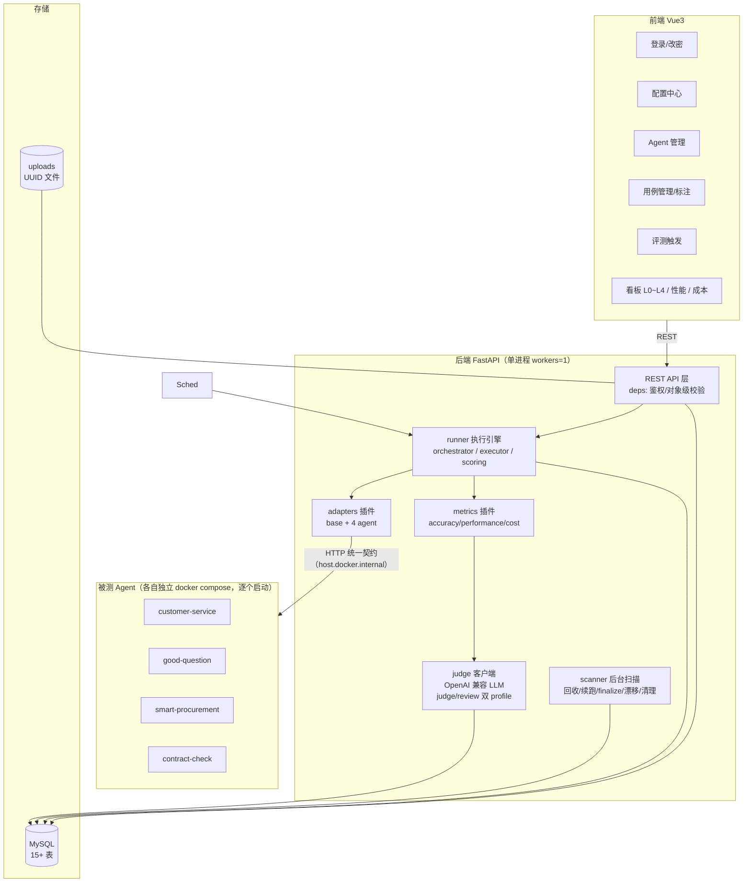
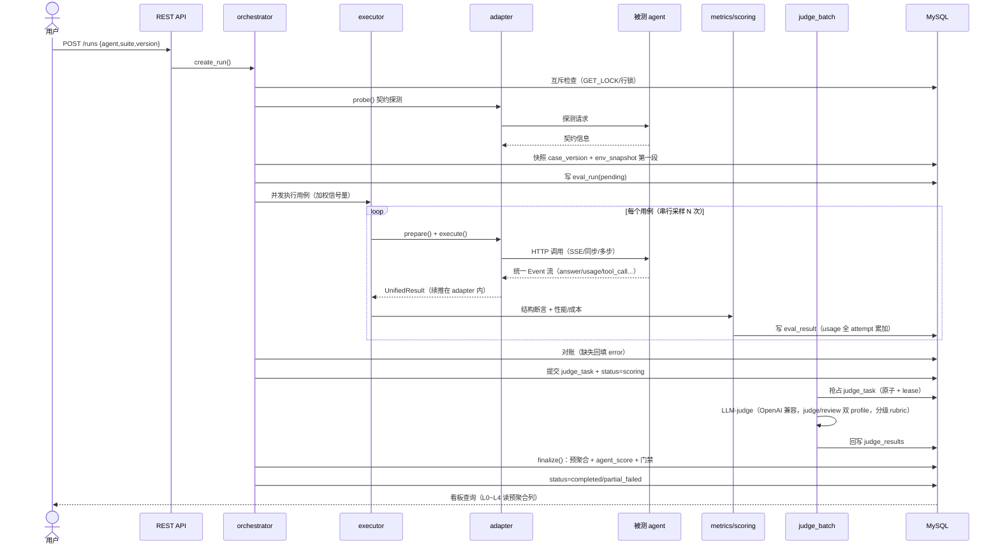
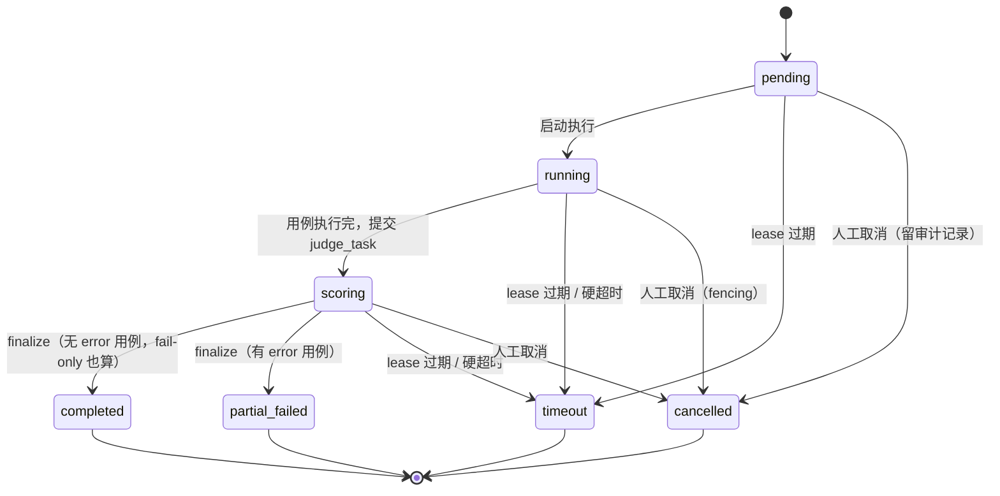
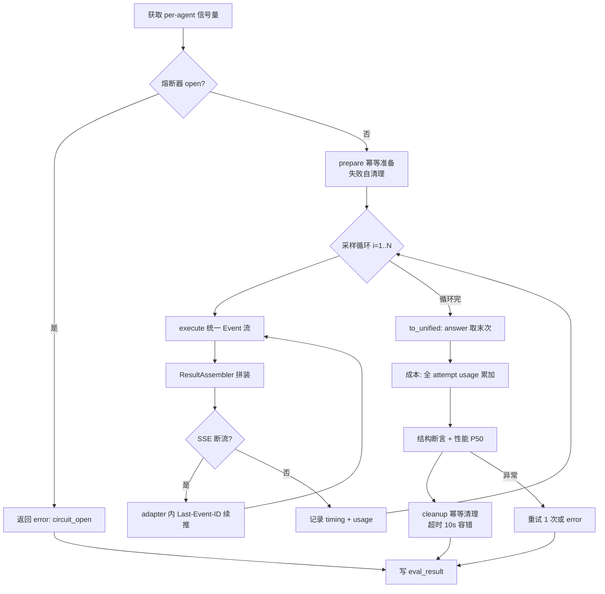
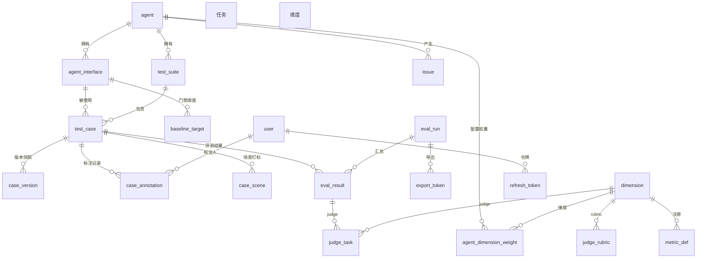
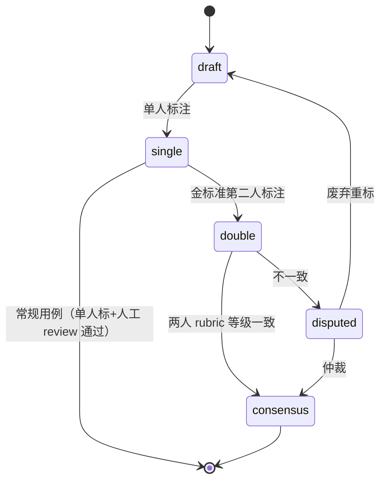
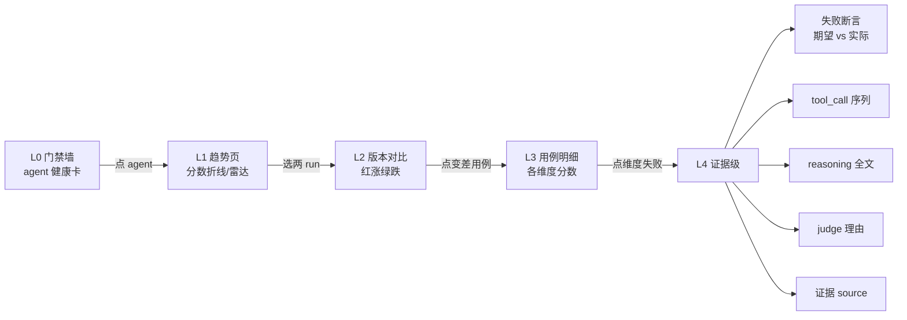

# AI Agent 评测系统 — 详设文档（v1.2，可编码）

> 依据 `solution.md`（v0.3，88 项决策）+ 五轮 subagent 研判修订；agent 真实形态见 `agent-baseline.md`。
> 本文是开发落地依据，优先级高于口述。P2/P3 项在正文以【P2】/【P3】标注。
> 文末「遗留问题清单」为第五轮 review 收敛的交叉引用不一致，进入 P1 编码时逐条落地。

## 一、技术栈与部署前提

| 层 | 选型 | 版本建议 |
|---|---|---|
| 语言 | Python | 3.11+ |
| Web 框架 | FastAPI + uvicorn | fastapi>=0.110 |
| ORM | SQLAlchemy 2.0 (async) + Alembic | sqlalchemy>=2.0 |
| 校验/配置 | pydantic v2 + pydantic-settings | pydantic>=2.0 |
| HTTP 客户端 | httpx（自定义 Transport 绑定校验 IP） | httpx>=0.27 |
| 加密 | cryptography（MultiFernet 多密钥） | cryptography>=42 |
| JWT | PyJWT（HS256 固定） | pyjwt>=2.8 |
| 密码哈希 | bcrypt（cost≥12） | bcrypt>=4 |
| 报告 | reportlab(PDF) + openpyxl(Excel) | 最新 |
| MySQL 驱动 | asyncmy | asyncmy>=0.2 |
| 前端 | Vue 3 + Vite + TS + Element Plus + Pinia + vue-router + axios + ECharts | — |

> **关键部署前提**：并发/熔断语义依赖**单进程**（`uvicorn workers=1`）。并发上限、熔断器、限流、scanner 周期循环均为进程内对象，多 worker 会失效。此约束写入 docker-compose 与启动脚本。

> **agent 运行形态（决策 #83）**：4 个被测 agent **各自独立 docker compose** 运行（端口映射到宿主机），评测平台容器经 `host.docker.internal` 访问宿主机端口。调试/评测时**逐个启动** agent（起一个→调试→关闭→再启下一个），不同时全起（本机资源限制）。

## 二、目录结构（文件级）

```
ai-evaluation/
├── backend/
│   ├── pyproject.toml / requirements.txt
│   ├── alembic/
│   │   ├── versions/                 # 迁移脚本
│   │   └── seed.py                   # 维度/内置算子/默认权重/admin 用户
│   ├── app/
│   │   ├── main.py                   # FastAPI 入口 + 启动钩子（扫 scoring 续跑：先对 scoring run 续 lease 再挂心跳，防被 scanner ① 抢先标 timeout）
│   │   ├── config.py                 # pydantic-settings，读 env（仅密钥）
│   │   ├── db.py                     # async engine（pool_size 显式配置）/ session factory
│   │   ├── deps.py                   # get_db / get_current_user / require_role / 对象级校验
│   │   ├── constants.py              # dimension.code / ALLOWED_CLASS_PATHS（插件白名单）常量
│   │   ├── models/                   # SQLAlchemy ORM 模型（对应 §三 DDL）
│   │   │   ├── agent.py interface.py suite.py case.py case_version.py case_annotation.py
│   │   │   ├── dimension.py scene.py weight.py baseline.py price.py
│   │   │   ├── run.py result.py judge_task.py rubric.py metric_def.py issue.py
│   │   │   ├── user.py refresh_token.py system_config.py export_token.py
│   │   ├── api/                      # REST 路由（对应 §四）
│   │   │   ├── auth.py users.py agents.py interfaces.py suites.py cases.py files.py
│   │   │   ├── scenes.py runs.py results.py issues.py dashboard.py
│   │   │   ├── settings.py plugins.py prices.py baselines.py export.py
│   │   ├── schemas/                  # pydantic request/response 模型
│   │   ├── core/
│   │   │   ├── sse_parser.py  assembler.py  errors.py
│   │   │   ├── security.py           # MultiFernet / JWT / bcrypt / refresh 轮换
│   │   │   ├── logging.py            # 结构化日志 + 脱敏
│   │   │   ├── circuit_breaker.py    # closed/open/half_open（进程内，单进程部署前提）
│   │   │   ├── limiter.py            # 加权信号量（先 per-agent 后全局）
│   │   │   └── http.py               # 统一出站 client（绑定校验 IP + 禁 redirect）
│   │   ├── adapters/
│   │   │   ├── engine.py             # 通用配置引擎（reset upsert + 组装请求 + 标准解析 + 多轮）
│   │   │   ├── schema.py             # adapter_config 校验（base_url/interface/reset/conversation_id）
│   │   ├── metrics/  assertions/  judge/  runner/  scanner.py  exporter/
│   ├── tests/                        # pytest
│   └── Dockerfile
├── frontend/ ...                     # views 含 Config/Performance/Cost/User/CaseDetail
├── uploads/                          # UUID 文件名，仅后端挂载
└── docker-compose.yml                # uvicorn workers=1
```

## 架构图与业务流程图（数据流）

### A. 总体架构图



### B. 评测主流程时序图（含数据流）



### C. run 生命周期状态机



### D. 单用例执行流程



### E. 评分数据流

```mermaid
flowchart TD
    UR[UnifiedResult] --> COMP[completeness<br/>规则断言]
    UR --> TOOL[tool_usage<br/>规则断言]
    UR --> FACT[factuality<br/>judge]
    UR --> REAS[reasoning_quality<br/>judge]
    UR --> TTFT[ttft 性能]
    UR --> COST[token_cost 成本]

    COMP -->|通过率×100| S1[分数]
    TOOL -->|通过率×100| S2[分数]
    FACT -->|等级×100 / N-A| S3[分数]
    REAS -->|等级×100 / N-A| S4[分数]

    S1 --> W[4 维加权<br/>剔除 N-A 重归一化<br/>防除零]
    S2 --> W
    S3 --> W
    S4 --> W
    W --> T[score_total]
    T --> G{门禁(用例级)<br/>该用例每维度 >= baseline_target}
    G -->|是| PASS[pass]
    G -->|否| FAIL[fail]
    TTFT --> PP[P50/P95 独立呈现]
    COST --> CP[成本独立呈现]
```

### F. 数据模型 ER 图



### G. 用例标注状态机



### H. 看板下钻数据流



## 三、数据库完整 DDL

```sql
-- 维度主表
CREATE TABLE dimension (
  id INT AUTO_INCREMENT PRIMARY KEY,
  code VARCHAR(64) NOT NULL UNIQUE,
  name VARCHAR(64) NOT NULL,
  category ENUM('accuracy','performance','cost') NOT NULL
);

CREATE TABLE agent (
  id INT AUTO_INCREMENT PRIMARY KEY,
  name VARCHAR(128) NOT NULL,
  base_url VARCHAR(512) NOT NULL,            -- 内网白名单校验
  adapter_type VARCHAR(128) NOT NULL,        -- 硬编码白名单
  adapter_config JSON NULL,                  -- 声明式字段映射（含 reset 接口配置 path/method/body，可页面填写或 JSON 导入）
  auth_config VARBINARY(4096) NULL,          -- 预留：生产鉴权/未来统一登录时使用；评测环境关鉴权留空
  contract_version VARCHAR(32) NULL,
  owner_id INT NULL,                         -- agent 负责人（角色=evaluator）：标注/评分基准制定时排除（独立评测，对象级校验禁止标自己 agent 的 golden_answer/断言）
  enabled BOOLEAN NOT NULL DEFAULT TRUE,
  created_at DATETIME NOT NULL DEFAULT CURRENT_TIMESTAMP
);

CREATE TABLE agent_interface (
  id INT AUTO_INCREMENT PRIMARY KEY,
  agent_id INT NOT NULL,
  name VARCHAR(128) NOT NULL,
  path VARCHAR(512) NOT NULL,
  method VARCHAR(8) NOT NULL DEFAULT 'POST',
  contract_type ENUM('sse','sync') NOT NULL,
  contract_version VARCHAR(32) NOT NULL,
  retryable BOOLEAN NOT NULL DEFAULT TRUE,
  enabled BOOLEAN NOT NULL DEFAULT TRUE,
  FOREIGN KEY (agent_id) REFERENCES agent(id),
  INDEX idx_interface_agent (agent_id)
);

CREATE TABLE test_suite (
  id INT AUTO_INCREMENT PRIMARY KEY,
  agent_id INT NOT NULL,
  name VARCHAR(128) NOT NULL,
  description TEXT NULL,
  created_at DATETIME NOT NULL DEFAULT CURRENT_TIMESTAMP,
  FOREIGN KEY (agent_id) REFERENCES agent(id)
);

CREATE TABLE test_case (
  id INT AUTO_INCREMENT PRIMARY KEY,
  suite_id INT NOT NULL,
  interface_id INT NOT NULL,
  name VARCHAR(128) NOT NULL,
  description TEXT NULL,
  input_type ENUM('text','file','conversation') NOT NULL,
  input JSON NULL,                           -- 统一 input 格式 {content,params,file_ref,data_id,conversation_id,seed}
  input_turns JSON NULL,                     -- conversation 时存 [{"turn":1,"content":"..."}]
  file_ref VARCHAR(128) NULL,
  expected JSON NOT NULL,                    -- {golden_answer, structure, judge_gold_scores, turn_golden_answers[]}
  assertions JSON NOT NULL,
  metrics JSON NOT NULL,
  status ENUM('draft','active','invalidated') NOT NULL DEFAULT 'draft',
  is_gold BOOLEAN NOT NULL DEFAULT FALSE,
  is_held_out BOOLEAN NOT NULL DEFAULT FALSE,  -- 留出集：owner 不可见，定期复测防过拟合
  annotation_status ENUM('draft','single','double','consensus','disputed') NOT NULL DEFAULT 'draft',
  validated_agent_version VARCHAR(64) NULL,   -- git_sha，与 env_snapshot.git_sha 同源
  validated_knowledge_version VARCHAR(64) NULL,
  needs_review BOOLEAN NOT NULL DEFAULT FALSE,
  created_at DATETIME NOT NULL DEFAULT CURRENT_TIMESTAMP,
  updated_at DATETIME NOT NULL DEFAULT CURRENT_TIMESTAMP ON UPDATE CURRENT_TIMESTAMP,
  FOREIGN KEY (suite_id) REFERENCES test_suite(id),
  FOREIGN KEY (interface_id) REFERENCES agent_interface(id),
  INDEX idx_case_suite (suite_id),
  INDEX idx_case_interface (interface_id)
);

CREATE TABLE case_version (
  id INT AUTO_INCREMENT PRIMARY KEY,
  case_id INT NOT NULL,
  version_no INT NOT NULL,
  content_hash CHAR(64) NOT NULL,
  snapshot JSON NOT NULL,                     -- {input,expected,assertions,metrics,weight,threshold,interface_id}  weight/threshold 从 agent_dimension_weight/baseline_target 冻结拷入
  created_at DATETIME NOT NULL DEFAULT CURRENT_TIMESTAMP,
  FOREIGN KEY (case_id) REFERENCES test_case(id),
  UNIQUE KEY uk_case_version (case_id, version_no),
  INDEX idx_case_version_hash (case_id, content_hash)
);

CREATE TABLE case_annotation (
  id INT AUTO_INCREMENT PRIMARY KEY,
  case_id INT NOT NULL,
  annotator_id INT NOT NULL,
  dimension_code VARCHAR(64) NOT NULL,
  level DECIMAL(3,2) NULL,
  note TEXT NULL,
  created_at DATETIME NOT NULL DEFAULT CURRENT_TIMESTAMP,
  FOREIGN KEY (case_id) REFERENCES test_case(id),
  FOREIGN KEY (annotator_id) REFERENCES user(id),
  FOREIGN KEY (dimension_code) REFERENCES dimension(code),
  UNIQUE KEY uk_annotation (case_id, annotator_id, dimension_code)  -- 同人同维度不重复标
);

CREATE TABLE scene_catalog (
  id INT AUTO_INCREMENT PRIMARY KEY,
  agent_id INT NOT NULL,
  scene_tag VARCHAR(64) NOT NULL,
  description VARCHAR(256) NULL,
  UNIQUE KEY uk_scene (agent_id, scene_tag),
  FOREIGN KEY (agent_id) REFERENCES agent(id)
);
CREATE TABLE case_scene (
  case_id INT NOT NULL,
  scene_tag VARCHAR(64) NOT NULL,
  PRIMARY KEY (case_id, scene_tag),
  FOREIGN KEY (case_id) REFERENCES test_case(id)
  -- agent 归属由 case→suite→agent 推导，不存冗余 agent_id
);

CREATE TABLE agent_dimension_weight (
  agent_id INT NOT NULL,
  interface_id INT NOT NULL DEFAULT 0,   -- 0=agent 级默认权重；非 0=该 interface 覆盖（双接口可差异化）
  dimension_code VARCHAR(64) NOT NULL,
  weight DECIMAL(5,4) NOT NULL,
  PRIMARY KEY (agent_id, interface_id, dimension_code),
  FOREIGN KEY (agent_id) REFERENCES agent(id),
  FOREIGN KEY (dimension_code) REFERENCES dimension(code)
);

CREATE TABLE baseline_target (
  agent_id INT NOT NULL,
  interface_id INT NOT NULL,                 -- 0=agent 级默认阈值（哨兵，非外键）；非 0=interface 覆盖
  dimension_code VARCHAR(64) NOT NULL,
  target_score DECIMAL(5,2) NOT NULL,
  calibration_source VARCHAR(256) NULL,      -- 标定来源（如「金标准校准集 P10 分位」/ 手动）
  approved_by_1 INT NULL,                    -- 审批人 1（双签）
  approved_by_2 INT NULL,                    -- 审批人 2（双签）
  approval_status ENUM('auto','pending_approval','approved') NOT NULL DEFAULT 'auto',  -- auto=自动标定直生；pending_approval=待双签；approved=双签通过才参与快照
  PRIMARY KEY (agent_id, interface_id, dimension_code),
  FOREIGN KEY (agent_id) REFERENCES agent(id),
  FOREIGN KEY (dimension_code) REFERENCES dimension(code)
);

CREATE TABLE model_price (
  model VARCHAR(64) NOT NULL,
  input_price DECIMAL(12,6) NOT NULL,
  output_price DECIMAL(12,6) NOT NULL,
  cache_hit_price DECIMAL(12,6) NULL,          -- 命中缓存单价（约 input 1/10）
  effective_from DATETIME NOT NULL,
  PRIMARY KEY (model, effective_from)
);

CREATE TABLE system_config (
  key VARCHAR(128) PRIMARY KEY,
  value JSON NOT NULL,
  scope ENUM('run','global','registration') NOT NULL DEFAULT 'global',  -- 作用域
  is_hot BOOLEAN NOT NULL DEFAULT TRUE,
  updated_at DATETIME NOT NULL DEFAULT CURRENT_TIMESTAMP ON UPDATE CURRENT_TIMESTAMP
);

CREATE TABLE eval_run (
  id INT AUTO_INCREMENT PRIMARY KEY,
  agent_id INT NOT NULL,
  suite_id INT NOT NULL,
  version VARCHAR(64) NOT NULL,
  trigger_type ENUM('manual','held_out') NOT NULL DEFAULT 'manual',  -- held_out=留出集复测（QA 手动触发，owner 不可见）
  status ENUM('pending','running','scoring','completed','partial_failed','timeout','cancelled') NOT NULL DEFAULT 'pending',
  generation INT NOT NULL DEFAULT 1,          -- fencing token（cancel 时自增）
  lease_until DATETIME NULL,                  -- 短租约（90s，心跳 30s 刷新）
  hard_deadline DATETIME NULL,                -- 硬超时（启动时落库，不随心跳续）
  started_at DATETIME NULL,
  finished_at DATETIME NULL,
  total_case INT NOT NULL DEFAULT 0,
  pass_case INT NOT NULL DEFAULT 0,
  fail_case INT NOT NULL DEFAULT 0,
  error_case INT NOT NULL DEFAULT 0,
  na_case INT NOT NULL DEFAULT 0,
  agent_score DECIMAL(6,2) NULL,
  judge_incomplete BOOLEAN NOT NULL DEFAULT FALSE,
  pinned BOOLEAN NOT NULL DEFAULT FALSE,        -- 关键上线版本：数据清理不删
  ttft_p50 DECIMAL(10,3) NULL, ttft_p95 DECIMAL(10,3) NULL,
  e2e_p50 DECIMAL(10,3) NULL, e2e_p95 DECIMAL(10,3) NULL,
  total_tokens INT NULL, total_cost DECIMAL(12,6) NULL,
  env_snapshot JSON NULL,                     -- 分两段：落库写 contract_version+adapter_config_hash；首个 meta 到达回填 git_sha/knowledge_version/model
  run_config JSON NULL,                       -- scope=run 配置的冻结值（run 创建时快照，在途 run 不受后续配置改动影响）
  FOREIGN KEY (agent_id) REFERENCES agent(id),
  FOREIGN KEY (suite_id) REFERENCES test_suite(id),
  INDEX idx_run_agent_started (agent_id, started_at),
  INDEX idx_run_agent_version (agent_id, version),
  INDEX idx_run_status_lease (status, lease_until),
  INDEX idx_run_agent_suite_started (agent_id, suite_id, started_at)
);

CREATE TABLE eval_result (
  id INT AUTO_INCREMENT PRIMARY KEY,
  run_id INT NOT NULL,
  case_id INT NOT NULL,
  case_version_id INT NOT NULL,
  data_id VARCHAR(128) NULL,                    -- reset(seed) 返回的真实数据 id（review_id/task_id），可空，追溯跑了哪条数据
  model VARCHAR(64) NULL,
  score_total DECIMAL(6,2) NULL,              -- 全维度 N/A 时为 NULL
  score_per_dimension JSON NULL,              -- 仅 accuracy 四维 [{code,value,na,na_reason}]
  pass_fail ENUM('pass','fail','error','na') NOT NULL,  -- na=全部准确性维度 N/A（score_total=NULL），照常落行
  answer MEDIUMTEXT NULL,
  reasoning MEDIUMTEXT NULL,
  tool_calls JSON NULL,
  usage JSON NULL,                            -- [{attempt, prompt_tokens, completion_tokens, total_tokens}] 全 attempt
  timing JSON NULL,                           -- [{attempt, start_ts, first_token_ts, end_ts}]
  assertion_results JSON NULL,
  judge_results JSON NULL,
  error_type VARCHAR(32) NULL,
  error_detail TEXT NULL,
  ttft_p50 DECIMAL(10,3) NULL, ttft_p95 DECIMAL(10,3) NULL,
  e2e_p50 DECIMAL(10,3) NULL, e2e_p95 DECIMAL(10,3) NULL,
  total_tokens INT NULL,                      -- 全 attempt 求和
  total_cost DECIMAL(12,6) NULL,
  finished_at DATETIME NULL,
  FOREIGN KEY (run_id) REFERENCES eval_run(id) ON DELETE CASCADE,
  FOREIGN KEY (case_id) REFERENCES test_case(id),
  FOREIGN KEY (case_version_id) REFERENCES case_version(id),
  UNIQUE KEY uk_result (run_id, case_id),     -- judge_task 外键锚点
  INDEX idx_result_case (case_id),
  INDEX idx_result_case_ver (case_version_id),
  INDEX idx_result_run_pf (run_id, pass_fail)
);

CREATE TABLE judge_task (
  run_id INT NOT NULL,
  case_id INT NOT NULL,
  dimension_code VARCHAR(64) NOT NULL,
  status ENUM('pending','processing','done','failed','pending_human') NOT NULL DEFAULT 'pending',
  attempts INT NOT NULL DEFAULT 0,
  claim_id VARCHAR(64) NULL,                  -- 抢占认领标识（每次认领唯一 token），认领 SELECT 用 WHERE claim_id=:mine
  lease_until DATETIME NULL,
  next_retry_at DATETIME NULL,
  result JSON NULL,
  updated_at DATETIME NOT NULL DEFAULT CURRENT_TIMESTAMP ON UPDATE CURRENT_TIMESTAMP,
  PRIMARY KEY (run_id, case_id, dimension_code),
  FOREIGN KEY (run_id, case_id) REFERENCES eval_result(run_id, case_id) ON DELETE CASCADE,
  FOREIGN KEY (dimension_code) REFERENCES dimension(code),
  INDEX idx_judge_status (status, next_retry_at)
);

CREATE TABLE judge_rubric (
  id INT AUTO_INCREMENT PRIMARY KEY,
  dimension_code VARCHAR(64) NOT NULL,
  interface_id INT NOT NULL DEFAULT 0,   -- 0=通用 rubric；非 0=该 interface 覆盖（双接口可用不同 rubric）
  version VARCHAR(16) NOT NULL,
  template JSON NOT NULL,
  UNIQUE KEY uk_rubric (dimension_code, interface_id, version),
  FOREIGN KEY (dimension_code) REFERENCES dimension(code)
);

CREATE TABLE metric_def (
  id INT AUTO_INCREMENT PRIMARY KEY,
  dimension_code VARCHAR(64) NOT NULL,
  class_path VARCHAR(256) NOT NULL,           -- 指向代码常量索引
  enabled BOOLEAN NOT NULL DEFAULT TRUE,
  FOREIGN KEY (dimension_code) REFERENCES dimension(code)
);
CREATE TABLE assertion_op_def (
  id INT AUTO_INCREMENT PRIMARY KEY,
  op VARCHAR(64) NOT NULL UNIQUE,
  class_path VARCHAR(256) NOT NULL
);

CREATE TABLE issue (
  id INT AUTO_INCREMENT PRIMARY KEY,
  agent_id INT NOT NULL,
  title VARCHAR(256) NOT NULL,
  description TEXT NULL,
  related_case_id INT NULL,
  related_dimension VARCHAR(64) NULL,
  severity ENUM('low','medium','high','critical') NOT NULL DEFAULT 'medium',
  status ENUM('open','fixing','fixed','verified','closed') NOT NULL DEFAULT 'open',
  created_run_id INT NULL,
  resolved_version VARCHAR(64) NULL,
  last_verify_run_id INT NULL,
  last_verify_result ENUM('reproduced','fixed','verified') NULL,
  FOREIGN KEY (agent_id) REFERENCES agent(id),
  FOREIGN KEY (related_dimension) REFERENCES dimension(code),
  FOREIGN KEY (created_run_id) REFERENCES eval_run(id) ON DELETE SET NULL,
  FOREIGN KEY (last_verify_run_id) REFERENCES eval_run(id) ON DELETE SET NULL,
  INDEX idx_issue_status (status),
  INDEX idx_issue_agent_status (agent_id, status)
);

CREATE TABLE user (
  id INT AUTO_INCREMENT PRIMARY KEY,
  username VARCHAR(64) NOT NULL UNIQUE,
  password_hash VARCHAR(256) NOT NULL,
  role ENUM('admin','evaluator','viewer') NOT NULL DEFAULT 'viewer',
  enabled BOOLEAN NOT NULL DEFAULT TRUE,
  failed_attempts INT NOT NULL DEFAULT 0,
  locked_until DATETIME NULL,
  password_changed_at DATETIME NULL,
  created_at DATETIME NOT NULL DEFAULT CURRENT_TIMESTAMP
);

CREATE TABLE refresh_token (
  id INT AUTO_INCREMENT PRIMARY KEY,
  user_id INT NOT NULL,
  token_hash CHAR(64) NOT NULL,
  family_id CHAR(36) NOT NULL,                -- 轮换族，检测复用后整族撤销
  expires_at DATETIME NOT NULL,
  revoked BOOLEAN NOT NULL DEFAULT FALSE,
  created_at DATETIME NOT NULL DEFAULT CURRENT_TIMESTAMP,
  FOREIGN KEY (user_id) REFERENCES user(id),
  INDEX idx_refresh_user (user_id),
  INDEX idx_refresh_family (family_id)
);

CREATE TABLE export_token (
  id INT AUTO_INCREMENT PRIMARY KEY,
  token_hash CHAR(64) NOT NULL,
  run_id INT NOT NULL,
  format ENUM('pdf','xlsx') NOT NULL,
  user_id INT NOT NULL,
  expires_at DATETIME NOT NULL,
  used BOOLEAN NOT NULL DEFAULT FALSE,
  created_at DATETIME NOT NULL DEFAULT CURRENT_TIMESTAMP,
  FOREIGN KEY (run_id) REFERENCES eval_run(id) ON DELETE CASCADE
);

-- 元评测漂移历史（judge 一致率序列）
CREATE TABLE judge_drift_history (
  id INT AUTO_INCREMENT PRIMARY KEY,
  dimension_code VARCHAR(64) NOT NULL,
  consistency_rate DECIMAL(5,4) NOT NULL,     -- 与 judge_gold_scores 的一致率
  judged_case_cnt INT NOT NULL,
  drift_flag BOOLEAN NOT NULL DEFAULT FALSE,
  created_at DATETIME NOT NULL DEFAULT CURRENT_TIMESTAMP,
  INDEX idx_drift_dim (dimension_code, created_at)
);

-- 审计日志（报告导出/凭证查看/敏感操作）
CREATE TABLE audit_log (
  id INT AUTO_INCREMENT PRIMARY KEY,
  user_id INT NOT NULL,
  action VARCHAR(64) NOT NULL,
  target_type VARCHAR(32) NULL,
  target_id VARCHAR(64) NULL,
  detail JSON NULL,
  ip VARCHAR(64) NULL,
  created_at DATETIME NOT NULL DEFAULT CURRENT_TIMESTAMP,
  INDEX idx_audit_user (user_id, created_at)
);
```

## 四、REST API 规格

统一约定：前缀 `/api`；响应 `{code, message, data}`；分页 `{items, total, page, page_size}`（上限 100）；错误态 `data=null`，业务 code 段见 §八。

### 4.1 认证与用户
| 方法 | 路径 | 说明 |
|---|---|---|
| POST | /auth/login | 登录（IP+用户名双维度限速/失败锁定） |
| POST | /auth/refresh | 轮换（检测旧 token 复用 → 整族撤销） |
| POST | /auth/logout | 撤销当前 refresh 族 |
| POST | /auth/change-password | 自服务改密（首登强制） |
| GET | /auth/me | 当前用户 + 角色 |
| GET/POST | /users | 用户列表/创建（admin） |
| PUT/DELETE | /users/{id} | 改角色/enabled/禁用（admin） |

### 4.2 agent 与接口（admin）
| 方法 | 路径 | 说明 |
|---|---|---|
| GET/POST | /agents | 列表/注册（白名单校验） |
| GET/PUT/DELETE | /agents/{id} | 详情/改（复校验）/删（停用 enabled=false） |
| POST | /agents/{id}/probe | 契约探测 |
| GET/POST | /agents/{id}/interfaces | 列表/新增 |
| GET/PUT/DELETE | /agents/{id}/interfaces/{iid} | 详情/改/删 |

### 4.3 用例/文件/场景（admin/evaluator）
| 方法 | 路径 | 说明 |
|---|---|---|
| GET/POST | /agents/{id}/suites | 列表/新增 |
| GET/PUT/DELETE | /suites/{sid} | 详情/改/删 |
| GET/POST | /suites/{sid}/cases | 列表（含 annotation_status 过滤）/新增 |
| GET/PUT/DELETE | /cases/{id} | 详情/改/作废（字段级权限：evaluator 可改 input/description，不可改 expected.golden_answer/assertions，后者仅 admin 或双签） |
| POST | /cases/{id}/annotate | 提交标注（写 case_annotation） |
| GET | /cases/pending-annotation | 标注待办队列 |
| PUT | /cases/{id}/scenes | 给用例打场景标签 |
| POST | /files | 上传（UUID + realpath + 类型 + 大小） |
| GET | /files/{uuid} | 下载（realpath + 角色） |
| POST | /cases/import | 批量导入（ProcessPool + 行数上限） |
| GET | /suites/{sid}/cases/export | 导出用例 |
| GET/POST | /agents/{id}/scenes | 场景清单 |

### 4.4 评测执行（admin/evaluator）
| 方法 | 路径 | 说明 |
|---|---|---|
| POST | /runs | 触发 `{agent_id,suite_id,version,trigger_type}` |
| GET | /runs | 历史列表（含 progress `{done,total}`） |
| GET | /runs/{id} | 详情（状态+汇总+进度） |
| POST | /runs/{id}/cancel | 取消（fencing + 中断在途 + 废弃残留 judge_task） |
| POST | /runs/{id}/rerun | 重跑（自动递增 version patch） |

### 4.5 结果与看板（三角色；viewer 仅 L0~L3，L4 证据不可达）
| 方法 | 路径 | 说明 |
|---|---|---|
| GET | /runs/{id}/results | 列表（defer 大字段；viewer 仅返回 pass_fail/score 摘要，裁 assertion_results/judge_results/source_detail） |
| GET | /results/{id} | L3 摘要（三角色；只含 score_total/score_per_dimension/pass_fail） |
| GET | /results/{id}/evidence | L4 证据（admin/evaluator；reasoning/tool_calls/answer 原文 + assertion_results 期望/实际 + judge 理由 + source_detail） |
| GET | /dashboard/agents | L0 门禁墙（agent 跨 suite 汇总） |
| GET | /dashboard/agents/{id}/trend | L1 趋势 |
| GET | /dashboard/compare | L2 版本对比 |
| GET | /dashboard/coverage | 覆盖率 |
| GET | /dashboard/agents/{id}/performance | 性能面板（读预聚合） |
| GET | /dashboard/agents/{id}/cost | 成本面板 |

**数据可见性（对象级，deps.py 实现）**：
- 留出集：`owner_id==当前用户` 时，`/suites/{sid}/cases` 过滤 `is_held_out=true`，`/runs` 及 `/dashboard/*` 过滤 `trigger_type='held_out'`（owner 不可见 held-out 用例与结果）。
- 职责分离：`owner_id==当前用户` 时禁止标/改自己 agent 的 `golden_answer`/`assertions`。
- 独立 QA：QA = 非该 agent owner 的 evaluator（独立第三方标注/评分基准）。

### 4.6 配置/插件/价格/基线（admin）
| 方法 | 路径 | 说明 |
|---|---|---|
| GET/PUT | /config/global | 全局业务参数（system_config） |
| GET | /config | 聚合配置 |
| GET/PUT | /agents/{id}/weights | 权重 |
| GET/PUT | /agents/{id}/interfaces/{iid}/targets | 阈值 |
| GET/POST | /model-prices | 价格 |
| GET/POST | /assertion-ops | 算子（admin，白名单校验） |
| GET/POST/PUT/DELETE | /rubrics | rubric |
| GET/POST | /issues | 问题（admin/evaluator；evaluator 可登记/查看自己关联） |
| GET/PUT | /issues/{id} | 详情/状态流转（admin/evaluator） |

### 4.7 报告导出
| 方法 | 路径 | 说明 |
|---|---|---|
| POST | /runs/{id}/export | 异步生成 → 一次性下载 token（落 export_token 表） |
| GET | /exports/{token} | 下载（一次性 + 角色校验 + 审计 + 水印） |

## 五、核心抽象接口

### 5.1 adapter 配置声明

```python
class Event(BaseModel):
    type: str       # meta/stage/reasoning/tool_call/answer/usage/done/error/confirm
    data: dict
    id: str | None = None
```

adapter 统一为**配置声明**（`adapter_config` JSON，agent 管理页填写/导入），通用配置引擎执行，per-agent 零代码。`base_url` 是**出站唯一来源**（engine 只读此处的 base_url；`agent.base_url` 列仅注册/改时做内网白名单校验并断言两者相等）：

```json
{
  "base_url": "http://host.docker.internal:8001",
  "interface": { "path": "/api/chat", "method": "POST", "contract_type": "sse" },
  "reset": { "path": "/admin/reset", "seed_field": "seed" },
  "conversation_id_field": "conversation_id"
}
```

通用配置引擎（`engine.py`，一次编写，所有 agent 复用）流程：`reset(seed)` upsert 拿真实 id（同步）→ 组装请求（固定 URL + input 透传 + conversation_id）→ 发请求 → 标准 SSE/JSON 解析 → 多轮循环 turns。「代码型 adapter」仅极端特殊 agent 兜底（当前 4 个均用配置型）。

### 5.2 Metric / AssertionOp / Judge（略，见 v1.0，无变化）

## 六、核心流程详设

### 6.1 run 生命周期（orchestrator.py）

```
create_run(agent_id, suite_id, version, trigger_type):
  1. 校验 version semver
  2. 互斥：agent 行 SELECT ... FOR UPDATE（不用 GET_LOCK，避免连接级锁泄漏），检查无 in (pending,running,scoring)
     否则拒绝（不落记录，返回 409）
  3. probe() 不达标 → 不落记录，返回 4xx
  4. 快照用例：content_hash 复用 case_version；snapshot 冻结 weight（agent_dimension_weight，interface 级）+ threshold（baseline_target）
  5. 组装 env_snapshot 第一段（contract_version + adapter_config_hash）
  6. 写 eval_run(pending, lease_until=now+90s, hard_deadline=now+run_timeout)
  7. 异步启动 execute_run()

execute_run(run):
  status=running（条件更新 WHERE status='pending'）
  并发执行用例（executor，受加权信号量）；独立心跳 asyncio task 贯穿 pending→running→scoring 全程，每 30s 刷新 lease_until（scoring 阶段慢 judge 不误杀）
  外层 try/finally：finally 取消心跳 task（主协程异常退出时 lease 不再被续，scanner ① 可回收，不占用互斥槽）
  对账：按 pass+fail+error+na == total_case 校验（全 N/A 已落行，不按行数），仅真缺行回填 error  ← 前置
  提交语义维度到 judge_task → 条件更新 status='scoring'
  await 全部 judge_task 达终态（done/failed，pending_human 等人工复核）→ finalize(run)

finalize(run):                                # 幂等可重入（WHERE finished_at IS NULL）
  计算预聚合列 + agent_score（非 error/na 用例均值）+ 门禁判定 + run 级 P50/P95/total_cost
  条件更新 status='completed'/'partial_failed' WHERE status IN ('running','scoring') AND finished_at IS NULL
  回填 env_snapshot 第二段（git_sha/knowledge_version/model，meta 必选）
  逐用例比对 env_snapshot 与 validated_* → 置 needs_review
  触发 issue 复现验证

scanner.py（后台 asyncio 周期循环，逐条 try/except 隔离 + 存活告警）:
  ① lease_until 过期的 pending/running → 标 timeout 并走 salvage+finalize（对已完成用例算分，不空置 agent_score）；scoring 的 lease 过期给宽限（连续 N 周期仍过期才 timeout，给崩溃重启后的 judge 恢复窗口）；cancelled 的已完成用例 usage 记账、不算分（不进 agent_score）
  ② judge_task 过期 lease 的 processing → 重置 pending（清 claim_id，含 next_retry_at 过滤）
  ③ hard_deadline 到期的 run → 未完用例标 error，残留 judge_task 废弃，judge 未 done 维度按 N/A 并置 judge_incomplete → salvage+finalize
  ③.5 pending_human 超时（updated_at + human_review_timeout）→ 自动降级（按已得 judge 结果标 N/A 并转 done），防 run 卡 scoring
  ④ scoring 态且 judge_task 无 pending/processing/pending_human → finalize(run)  ← 兜底收尾
  ⑤ issue 复现（幂等：last_verify_run_id 判空；跳过 error 用例）
  ⑥ judge 漂移（重判 is_gold，比对 judge_gold_scores，写 judge_drift_history）
  ⑦ 数据清理（(agent,suite) 分批删旧 run，**排除 pinned 关键版本** + 清过期/已用 export_token + agent 侧定期清库任务）
  ⑧ 留出集复测：QA 手动触发 held_out run（trigger_type=held_out，跑该 agent 的 held-out 专用 suite，owner 不可见结果）；finalize 时算 overfit_gap = 最近正式 run agent_score - 留出 run agent_score，超 overfit_threshold → 写告警 + agent 门禁降级「过拟合」
```

### 6.2 单用例执行（executor.py）

```python
async def run_case(case, adapter, breaker, limiter, perf_repeat):
    async with limiter.acquire(agent):         # 先 per-agent，后全局（加权信号量，防饿死）
      if breaker.state == 'open': return error("circuit_open")
      if breaker.state == 'half_open' and not breaker.try_acquire_probe(): return error("circuit_open")  # half_open 单探针试探放行 1 次
      attempts = []                            # 声明在外层，重试不清空
      repeat = 1 if config.side_effect else perf_repeat  # 副作用接口不重复采样
      for i in range(repeat):                  # 串行采样，每次 reset(seed) upsert 归位（保证每次=首次请求一致状态）
        for attempt in (0, 1):                 # 每采样最多重试 1 次（重新 reset + execute）
          try:
            data_id = await engine.reset(config, case.seed)   # reset(seed) upsert 归位，返回真实 id（同步）；reset 阶段 per-agent 锁串行（防并发 reset 互踩），execute 才并发
            start = perf_counter(); assembler = ResultAssembler()
            async for ev in engine.execute(config, case, data_id):   # 固定 URL + input 透传 + conversation_id
              assembler.on_event(ev, perf_counter() - start)
            attempts.append({"timing": assembler.timing_entry, "usage": assembler.usage})
            break
          except Exception as e:
            if isinstance(e, (Timeout, StreamBroken)) and attempt == 0 and not config.side_effect:
              continue                         # 重试本采样（重新 reset + execute；副作用接口不重试，防重复执行业务）
            return error(e, partial_usage=attempts)  # 技术失败也记账（失败已产生 token）
      unified = assembler.to_unified()         # answer/reasoning 取末次
      return partial_result(unified, attempts) # total_tokens/total_cost 对 attempts 全量累加

多轮用例（input_type='conversation'）：body 带 conversation_id（评测系统生成固定标识）；`for turn in case.input_turns` 循环 execute(turn) 采每轮 answer（agent 按 conversation_id 维护上下文）；token 成本整段累加；每轮独立记 timing（首轮 TTFT 可测）；`perf_repeat` 性能重复采样仅用于单轮用例，多轮不重复采样，**仅首轮 TTFT 进 P50/P95 分布**（首轮即单次请求，语义干净）。
```

### 6.3 SSE 解析器（无变化，略）

### 6.4 ResultAssembler（补充：去重用 set 存已见 id，或利用 id 单调记 last_seen_id）

### 6.5 评分合成（runner/scoring.py）

```
评分（N/A 维度级，防除零）：
  纯规则维度（completeness/tool_usage）= 断言通过率 × 100（连续分，进加权）
  语义维度（factuality/reasoning_quality）：
    若有结构断言 → 断言作为扣分项（不否决）：每挂一条扣 assertion_penalty(默认30) 分，judge 照常判；维度分 = max(0, judge等级×100 − 挂断言数×assertion_penalty)
    judge 等级 × 100（judge 采样 judge_repeat 次取均值，方差存 score_var，供门禁保守判定）；judge 失败 → {value:null, na:true, na_reason:judge_fail}
  全 N/A（有效维度为空）→ score_total=NULL，pass_fail='na'（照常落行，计入 na_case）
  总分 = 有效维度加权（剔除 N/A 重归一化，防除零）
  run.judge_incomplete = 语义维度 N/A 权重占比 > judge_na_threshold(0.3)（分母=全部 accuracy 权重和）
    → L0/门禁跳过该 run，标「评分不完整」不判 pass/fail
  权重/阈值一律读 case_version.snapshot（weight+threshold 冻结值）；scope=run 配置（case_timeout/perf_repeat_count/judge 参数等）一律读 eval_run.run_config，实时配置只影响新 run 快照
  agent_score = 非 error 且非 na 用例（pass+fail）score_total 的均值；分母为 0 时置 NULL
  多轮用例分值 = 各轮分别判分（每轮用对应 turn_golden_answers[i]）取平均作总分；但任一 turn 任一维度 < 阈值 → 用例 fail（关键轮失败不被平均稀释）
  门禁（用例级，定死）：用例 pass = 每有效维度 >= snapshot.threshold（语义维度用 judge 均值 - σ 保守判定，防随机抖动误 pass）；suite pass = 该 suite 全部用例 pass；agent 汇总 = 当前最新 version 下各 suite run 的 agent_score 按用例数加权（非最新 version 的 suite 标「陈旧」，不计入 L0 总分，L0 卡提示「N 个 suite 数据陈旧」）
  error 硬门禁：error 数 > 0 → run 不判 pass（标 partial_failed，L0 不绿）；error 率 > error_rate_block(0.1) → 直接 block；任一 suite error 数 > 0 → agent 级 L0 不绿（error 不进 agent_score 但独立红线）
```

### 6.5.1 评分稳定性（run 间方差）

- 同版本多次 run（手动触发，关键版本上线前建议 3 次），看板聚合各 run 的 agent_score 及各维度分，取「均值 μ + 标准差 σ」。
- run 间 σ 反映「agent 输出随机性 + judge 随机性」综合波动；前提是数据一致（每次采样 reset(seed) upsert 归位），否则测到的是数据污染假波动。
- 版本对比显著判定：|μ_A − μ_B| > 2 × max(σ_A, σ_B) → 标「显著变化」，否则标「波动范围内」。
- judge 版本变更：强制对基准 run（pinned 关键版本）重评，消 judge 版本差异后再对比。

### 6.6 judge 批处理（消费 judge_task 表）

```
worker 抢占（claim_id 认领 + 原子 + attempts 上限）：
  UPDATE judge_task SET status='processing', claim_id=:mine, lease_until=now+X, attempts=attempts+1
  WHERE status='pending' AND (next_retry_at IS NULL OR next_retry_at<=NOW()) AND attempts < judge_max_retries
  LIMIT batch_size
  -- claim_id 承担认领职责（WHERE claim_id=:mine 取回自己抢到的）；lease 只负责超时回收，X ≥ judge_call_timeout×1.5
单次 LLM 调用 = 1 个 (case,dimension)；reasoning/answer/golden/input 统一 token 预算截断
judge 禁用工具；随机分隔符；输出 schema 强约束（含 confidence 字段，驱动升级复核）
429/503 且 attempts<max → status 回 pending + next_retry_at（退避）；attempts>=max → failed（scoring 折算 N/A）
4xx → failed
confidence < judge_review_confidence / 阈值边界 / 分歧大 → 升级复核（review profile 默认异构，非强制）或 pending_human（需人工复核 API 回写 done；human_review_timeout 超时自动降级；finalize 等待其非 pending）
judge 结果回写与 status='done' 同事务提交（或同一原子 UPDATE），避免 finalize 读到半成品
```

### 6.7 contract-check 多步封装（走 execute()，无变化，略）

## 七、配置项清单（落 system_config 表）

> `scope` 语义：`run`=仅 run 创建时读取并快照（在途 run 不受影响）；`global`=进程级实时（下次读取即生效）；`registration`=仅 agent 注册/文件上传时校验。`is_hot=false`=改后需重启。

| key | 类型 | 默认 | 单位 | scope | 热生效 |
|---|---|---|---|---|---|
| global_max_inflight | int | 16 | 个 | run | 是 |
| per_agent_concurrency | int | 3 | 个 | run | 是 |
| case_timeout | int | 120 | s | run | 是 |
| contract_check_timeout | int | 300 | s | run | 是 |
| sse_idle_timeout | int | 60 | s | run | 是 |
| run_timeout | int | `min(固定上限120min, ceil(case数/max(1,活跃run数+1)) × repeat × max(各interface timeout) × (max_retries+1) × 1.5 + ceil(语义维度任务数 × judge_repeat ÷ judge_concurrency) × judge_call_timeout)`，估算值封顶 120min | s | run | 是 |
| perf_repeat_count | int | 5 | 次 | run | 是（P50/P95 都算；默认 5 便于验证效果，P95 暂忍受不准，未来加大到 ≥20 才可靠） |
| retain_runs | int | 50 | 次 | global | 是 |
| judge_concurrency | int | 4 | 个 | run | 是 |
| judge_call_timeout | int | 120 | s | run | 是 |
| judge_na_threshold | float | 0.3 | — | run | 是（第三态防滥用：仅 admin 可改 + 审计） |
| error_rate_block | float | 0.1 | — | run | 是（error 率硬门禁：超过 block，不判 pass） |
| assertion_penalty | int | 30 | 分/条 | run | 是（语义维度规则断言扣分单价：每挂一条扣分，不否决） |
| judge_review_confidence | float | 0.7 | — | run | 是 |
| human_review_timeout | int | 86400 | s | run | 是（pending_human 超时自动降级，防 run 卡 scoring） |
| judge_max_retries | int | 2 | 次 | run | 是 |
| judge_repeat | int | 2 | 次 | run | 是（语义维度 judge 采样次数，取均值降随机；成本敏感可调 1，需更稳可调 3+） |
| overfit_threshold | float | 15 | 分 | run | 是（正式分-留出分 超过此值判定过拟合，门禁降级） |
| judge_llm.base_url | str | 异厂商 OpenAI 兼容端点 | — | global | 是（首评 judge，默认与被评 agent 不同厂商消除同模型偏袒；非强制，同厂商仅告警） |
| judge_llm.model_name | str | — | — | global | 是（同上） |
| review_llm.base_url | str | 异构厂商 OpenAI 兼容端点 | — | global | 是（升级复核，默认与首评 judge 不同；非强制，同厂商仅告警） |
| review_llm.model_name | str | — | — | global | 是（同上） |
| breaker_failure_threshold | int | 5 | 次 | run | 是 |
| breaker_open_duration | int | 60 | s | run | 是 |
| breaker_half_open_probe | int | 1 | 次 | run | 是 |
| retry_backoff_max | int | 10 | s | run | 是 |
| max_retries | int | 1 | 次 | run | 是 |
| heartbeat_interval | int | 30 | s | global | 否 |
| file_max_size | int | 50 | MB | registration | 是（与 agent 上传上限 50MB 一致） |
| base_url_allowlist | list | CIDR 列表 | — | registration | 否（改需重启，SSRF 出站闸口不热生效） |
| llm_allowlist | list | api.deepseek.com, dashscope.aliyuncs.com, open.bigmodel.cn, api.moonshot.cn | — | global | 是（judge 出站白名单，与 agent 内网白名单分离；默认预设常用 OpenAI 兼容厂商，按实际选用增删） |

env 仅密钥：`fernet_keys`（逗号分隔多代）、`db_password`、`judge_api_key`（judge profile 的 api_key）、`review_api_key`（review profile 的 api_key）、`jwt_secret`（≥256bit）。

## 八、错误码约定

HTTP 层业务 code 段：
- `1xxx` 认证（1001 token 失效、1002 无权限、1003 账号锁定）
- `2xxx` 资源（2001 不存在、2002 已存在/冲突、2003 校验失败）
- `3xxx` 评测（3001 run 互斥冲突、3002 契约不达标、3003 已在评测中）
- `4xxx` 文件（4001 类型不允许、4002 超大小、4003 路径非法）

`eval_result.error_type`（技术，pass_fail=error）：timeout / circuit_open / sse_eof_no_done / sse_parse_error / contract_missing_usage / agent_5xx / prepare_failed。
`na_reason`（维度级，进 score_per_dimension）：judge_fail / ttft_ns / metric_na。

## 九、安全基线实现要点

1. **SSRF（防 rebinding）**：出站分两类走不同白名单——① **被评 agent 出站**（`base_url`）：`core/http.py` 自定义 Transport 先 `getaddrinfo` 解析→校验全部 IP 在 `base_url_allowlist`（内网）内→**用校验过的 IP 直连并透传 Host 头**（禁止二次解析）；② **judge 出站**（`llm_profile.base_url`）：独立 `llm_allowlist`（模型厂商/公司 LLM 网关域名+IP），不套 agent 内网白名单，否则误伤公网模型。二者均 `follow_redirects=False`；allowlist 未配置默认 deny；`ipaddress.ip_network` 覆盖 v4/v6+mapped；path 校验在 URL 规范化后做（处理 `%2F` 等）。
2. **插件 RCE**：`ALLOWED_CLASS_PATHS` 为代码内 frozenset 常量（`constants.py`），DB 只存指向该集合的索引，绝不可经 API/DB 增删；加载用 `importlib.import_module`+`getattr`，禁 eval/exec/`__import__`；`adapter_config`/`assertions.args` 限声明式字段。
3. **JWT**：`algorithms=["HS256"]` 硬编码；access 15~30min；refresh 轮换 + `family_id` 复用检测（旧 token 复用→整族撤销）；角色/enabled 每请求查 DB（不信任 JWT 内角色）。
4. **凭证**：MultiFernet 多密钥（`fernet_keys` 逗号分隔）；GET 不回传 auth_config（仅回"已配置"布尔）；PUT 缺省=保留原值；解密只在发请求时内存进行。
5. **文件**：`os.path.commonpath([real, uploads_real]) == uploads_real` 校验；Content-Length 预检 + 分块写入边写边计上限；扩展名+MIME+魔数三重校验。
6. **prompt injection**：judge `tools=[]`；随机分隔符包裹所有不可信片段（含 answer/golden/input/文件）；rubric 用占位符字符串替换（禁模板引擎）；输出 JSON Schema 强约束；**rubric 声明「黄金答案内不得含评分指令，检测到即判 invalid/降级」，并把 golden/input 含指令纳入升级复核触发条件**。
7. **XSS/CSRF**：前端所有不可信字段（reasoning/tool_calls/answer/judge reason/source_detail）文本插值转义，禁 `v-html`；token 用 httpOnly cookie + `SameSite=Lax`（或 Strict）；关键写操作（触发 run/改用例/注册 agent）加 CSRF token；若前端需 `SameSite=None`，写接口强制校验自定义头。
8. **日志脱敏**：core/logging.py 统一脱敏（Authorization/token/凭证/下载 token 路径）。
9. **SQL**：全走 ORM 参数化；动态 order_by 仅字段白名单。
10. **登录**：限速按「IP+用户名」双维度；锁定窗口宜短；bcrypt cost≥12；admin 种子随机密码 + 首登强制改密（/auth/change-password）。
11. **agent 侧鉴权开关**：4 个 agent 鉴权均改为 env 开关（AUTH_ENABLED），评测环境关（评测直连，无需凭证）、生产环境开（未来统一登录）；auth_config 留空仅备用。

## 十、P1 任务拆分

1. 脚手架：FastAPI + config + db(pool_size 显式) + alembic + docker-compose(workers=1) + 用户/RBAC + 日志脱敏 + **bcrypt 走 run_in_executor（禁同步哈希阻塞事件循环）**。
2. 模型：§三 DDL 全落 SQLAlchemy + 迁移 + seed.py。
3. 核心：sse_parser + assembler(去重 set) + circuit_breaker + limiter(加权信号量) + errors + security + http(绑定 IP)。
4. adapter：通用配置引擎（engine.py）+ schema.py（adapter_config 校验）+ 4 agent 的 adapter_config 配置声明。**【配置型转正，4 agent 纯配置，代码型仅极端兜底】**
5. 断言：AssertionOp 基类 + 内置算子。
6. metrics：completeness/tool_usage + ttft/e2e/token_cost(全 attempt 求和)。
7. runner：orchestrator(条件更新+fencing+finalize 幂等) + executor(采样/confirm/续推) + scoring(维度级 N/A+防除零+suite 级门禁) + judge_batch(judge_task 表)。**【judge_batch P1 仅搭队列骨架，P2 启用】**
8. api：全部 §四 路由。
9. scanner：run 超时回收(pending 也回收) + judge_task 续跑 + 硬超时 + finalize 兜底 + 数据清理。
10. 前端：登录 + 配置中心 + agent 管理 + 用例管理(文件上传+编辑+标注待办) + run 触发/列表 + 看板 L0/L1/L3/L4 + 性能/成本面板 + 用户管理。
11. 初始化脚手架：codegraph 接口发现 + 场景清单提取。
12. 导出：PDF/Excel（ProcessPoolExecutor 单例池；**父进程 event loop 取数→序列化传子进程→子进程只渲染，禁跨 fork 传父 async engine** + export_token 表）。
13. 测试：pytest（sse_parser/assembler/scoring 含 N/A 归一化与除零/断言算子/adapter 多步 mock/权限边界 viewer 裁剪）。
14. 验收：good-question 改造（agent 侧 docker compose 起、逐个调试）+ 评测平台跑用例，采到 usage/TTFT/E2E，看板出分可下钻可导出。

> 并行依赖：good-question 契约改造（agent 侧）。调试约束：agent 各自 docker compose，逐个启动、用完关闭再启下一个。P2 backlog：judge 启用、issue 复现、升级复核、双人标注仲裁、告警、元评测漂移、日志导入、配置型 adapter。

## 十一、前端页面规格（页面 × 组件 × 效果 × 角色）

> 16 个页面。每页标注：用途、功能组件、交互效果、可达角色、调用的接口。

### 1. 登录页
- 组件：用户名输入框、密码输入框、登录按钮、错误提示条
- 效果：登录成功跳 L0；失败提示；账号锁定提示；首登强制跳改密
- 角色：未登录 · 接口：`/auth/login`

### 2. 改密页
- 组件：旧密码、新密码、确认密码
- 效果：首登强制；成功后跳 L0
- 角色：所有已登录 · 接口：`/auth/change-password`

### 3. 门禁墙 L0（首页）
- 组件：agent 健康卡网格（每卡：agent 名、总分大字、pass/fail 徽章、小维度雷达图、最近版本+时间、趋势箭头）
- 效果：pass 绿 / fail 红 / `judge_incomplete` 灰「评分不完整」；点卡进 L1
- 角色：所有 · 接口：`/dashboard/agents`

### 4. 单 agent 趋势页 L1
- 组件：分数折线图（时间序列）、维度雷达图、各 suite 得分柱状图、历史 run 列表
- 效果：hover 显分数；点 run 进 L3；时间范围过滤
- 角色：所有 · 接口：`/dashboard/agents/{id}/trend`

### 5. 版本对比页 L2
- 组件：两个 run 选择器、diff 表格（总分/维度/suite/用例，红涨绿跌）
- 效果：选 run A/B 对比；红跌绿涨；点用例进 L4
- 角色：所有 · 接口：`/dashboard/compare`

### 6. run 详情页 L3
- 组件：run 汇总卡（状态/总分/进度/耗时/触发方式）、用例结果表格（分页、pass_fail 过滤、红黄绿行标注）、取消/重跑按钮、导出按钮
- 效果：过滤、分页、点用例进 L4；导出触发异步下载
- 角色：所有（viewer 无取消/重跑/导出） · 接口：`/runs/{id}`, `/runs/{id}/results`, `/runs/{id}/export`

### 7. 用例证据页 L4
- 组件：维度分数面板、失败断言对比（期望 vs 实际）、tool_call 序列、reasoning 全文、judge 理由、证据 source 片段
- 效果：折叠/展开、代码高亮
- 角色：admin/evaluator（viewer 403） · 接口：`/results/{id}/evidence`

### 8. 性能面板页
- 组件：TTFT/E2E 的 P50/P95 折线图、分布图、样本量标注
- 效果：时间/suite 过滤；hover 显数值
- 角色：所有 · 接口：`/dashboard/agents/{id}/performance`

### 9. 成本面板页
- 组件：token 成本折线图、按 suite/case/model 汇总表
- 效果：过滤、按模型分组
- 角色：所有 · 接口：`/dashboard/agents/{id}/cost`

### 10. Agent 管理页
- 组件：agent 列表表格、新增/编辑表单（base_url/adapter/凭证可选/reset 接口）、契约探测按钮（逐字段结果弹窗）、接口列表（手动录入 path/method/contract_type）、权重配置、门禁阈值配置、插件注册、rubric 管理；reset 接口支持页面填写（URL/方法/参数）+ JSON 导入两种录入方式
- 效果：探测返回逐字段结果；权重/阈值可配；注册校验白名单
- 角色：admin · 接口：`/agents`, `/probe`, `/interfaces`, `/weights`, `/targets`, `/assertion-ops`, `/rubrics`

### 11. 用例管理页
- 组件：suite 列表、用例表格（含状态/标签/标注状态）、用例编辑表单（input/expected/assertions/metrics）、标注面板（单人/双人/一致性/仲裁）、文件上传、场景打标、批量导入导出
- 效果：CRUD、软删除、标注流转、待办队列、文件上传校验
- 角色：admin/evaluator · 接口：`/suites`, `/cases`, `/annotate`, `/pending-annotation`, `/scenes`, `/files`, `/cases/import`

### 12. run 触发/列表页
- 组件：触发表单（选 agent/suite/version）、run 历史表格（状态/进度/汇总）、取消/重跑按钮
- 效果：触发、进度实时、取消/重跑
- 角色：admin/evaluator · 接口：`/runs`, `/runs/{id}/cancel`, `/runs/{id}/rerun`

### 13. 配置中心页
- 组件：全局参数表单、模型价格列表
- 效果：读写、热生效提示
- 角色：admin · 接口：`/config/global`, `/config`, `/model-prices`

### 14. 用户管理页
- 组件：用户列表表格（用户名/角色/状态）、新增/编辑表单、重置密码按钮、禁用按钮
- 效果：CRUD、禁用、重置密码
- 角色：admin · 接口：`/users`

### 15. 问题列表页
- 组件：issue 表格（标题/严重度/状态/关联用例）、登记表单、状态流转按钮、复现状态标签
- 效果：登记、流转、复现显示
- 角色：admin/evaluator · 接口：`/issues`

### 16. 覆盖率页
- 组件：场景清单、覆盖矩阵（场景 × 用例，已覆盖/未覆盖高亮）
- 效果：盲区高亮
- 角色：所有 · 接口：`/dashboard/coverage`

## 十二、P1 编码前需消化的遗留问题清单（第五轮 review 收敛）

> 性质说明：以下均为「交叉引用不一致」，本质是编码期用 pytest/编译器兜底的问题，不再通过文档 review 迭代收敛。P1 编码时逐条落地并配对应测试断言。编号对应正文，非决策编号。

### 高危（7 条，多 agent 交叉确认）

| # | 问题 | 修复方向 | 对应章节 |
|---|---|---|---|
| 1 | `claim_id` 用「进程启动 UUID」，单进程 4 并发 worker 共享同值 → 重复认领 + 结果覆盖 | **已解决**：正文已定死「每次认领唯一 token」+ 回写带 `claim_id+status` 栅栏 | §6.6 / §三 judge_task |
| 2 | `content_hash` 复用与 weight/threshold 冻结矛盾 → 改权重/阈值静默用旧值 | content_hash 覆盖完整 snapshot（含 weight/threshold），或每 run 强制新快照 | §6.1 step4 / §三 case_version |
| 3 | `run_timeout = max(上限,估算)` 把上限写反成下限 | **已解决**：§七 正文已改 `min(上限,估算)`（估算值封顶） | §七 |
| 4 | 失败 attempt 的 token 漏记（`attempts.append` 在循环后） | append 放循环内 try/finally，Timeout 时该次 usage 也记账 | §6.2 |
| 5 | timeout salvage 与 finalize 守卫矛盾（timeout 状态写不进分数） | finalize 守卫含 timeout，或先 salvage 再置 timeout | §6.1 |
| 6 | 心跳「推进循环内刷新」→ scoring 阶段停跳，judged run 被误标 timeout | 心跳为独立 asyncio task 贯穿全程（含 scoring） | §6.1 |
| 7 | meta 升必选，但 contract-check 同步变体无 meta → 成本/时效断链 | 同步变体补 meta（或 model/git_sha 来源）+ 缺失降级分支 | §6.1 finalize / solution §5.2 |

### 中危（去重后，按类别）

| # | 问题 | 修复方向 | 对应章节 |
|---|---|---|---|
| 8 | `agent_score`「成功用例」= pass+fail 还是 pass，有歧义 | 与决策方确认后写死无歧义表述 | §6.5 / solution #62 |
| 9 | N/A 维度是否参与门禁（每维度 >= target）未定义 | 明确门禁仅对非 N/A 有效维度校验 | §6.5 |
| 10 | `baseline_target` 消费规则只在图 E，文本未落地 | §6.5 补「用例 pass = 每有效维度 >= snapshot.threshold」 | §6.5 |
| 11 | 门禁「suite 全部 pass」未排除 error/na | 明确在非 error/na 用例上判定 | §6.5 |
| 12 | agent 汇总 suite 加权「用例数」口径不闭合 | 明确 = 该 run 的 pass+fail 数（与一级分母同口径） | §6.5 |
| 13 | 状态机 fail-only（有 fail 无 error）终态未定义 | 无 error → completed；有 error → partial_failed | §C / §6.1 |
| 14 | `judge_max_retries` off-by-one（retries vs attempts 口径） | 认领条件改 `attempts <= max` 或改名 `max_attempts` | §6.6 / §七 |
| 15 | judge_task attempts 耗尽卡 pending（worker 崩溃路径） | scanner ② 判 attempts 满 → 直接置 failed | §6.6 / scanner ② |
| 16 | judge 失败分类不全（5xx/timeout/解析失败） | 补齐可重试/不可重试分类，异常必收敛终态 | §6.6 |
| 17 | judge 回写 fencing 未写明 | 回写 `WHERE claim_id=:mine AND status='processing'` | §6.6 |
| 18 | pending_human 无超时 + 无出口 API | **已解决**：正文已落地 resolve API + `human_review_timeout` 超时降级 | §6.6 / §四 |
| 19 | `eval_result.usage` 丢弃 cache_hit/miss | 补存 cache 字段，成本按 miss/hit 分开计 | §三 eval_result |
| 20 | scanner ① lease salvage 未对称回填 error | salvage 抽公共函数，①③ 共用「回填 error→算分」 | §6.1 |
| 21 | probe 在互斥锁事务内持行锁 | probe 移出锁事务或强制超时，锁只覆盖检查+insert | §6.1 |
| 22 | ProcessPool fork 死锁 + pickle 阻塞事件循环 | 用 spawn + 分页取数 + 后台任务队列 | §十 task12 / §4.7 |
| 23 | P95 口径矛盾未清干净（vs 决策 #23） | P50/P95 都算，perf_repeat_count 默认 5（P95 暂不准，未来加大） | §七 / 图 D·E / solution #23 |
| 24 | scope=run 配置无快照落点 | **已解决**：正文 DDL 已补 `run_config JSON` | §七 / §三 eval_run |
| 25 | `heartbeat_interval` scope/is_hot 矛盾 | 统一语义（is_hot=false 归 startup 或改 hot） | §七 |
| 26 | evaluator 可改自家 golden_answer（职责分离） | 改 golden_answer/assertions 剥离给 admin 或双签 | §4.3 / solution #42 |
| 27 | 报告下载 `/exports/{token}` 授权边界未写死 | 强制 `token.user_id==当前用户` + 拒绝 viewer | §4.7 |
| 28 | L2 compare 返回体未声明裁剪 | 明确只回分数摘要，排除证据字段 | §4.5 |
| 29 | issue「看自己关联」无字段支撑 | 加 `reporter_id`，或简化为全可见 | §4.6 / §三 issue |
| 30 | base_url_allowlist 无下限守护 | 禁 0.0.0.0/0 + audit + is_hot=false | §7 / §9.1 |
| 31 | JWT 密钥缺启动强校验 | 启动钩子校验非空且 >=256bit，否则 exit | §7 / §9.3 |
| 32 | 存储型 XSS（reasoning/answer 渲染） | 转义 + CSP + 渲染点专项测试 | §9.7 / §4.5 |
| 33 | seed 默认权重模板含禁用维度 → 归一化分母出错 | seed 权重模板只含启用维度（P1） | §三 agent_dimension_weight / seed.py |
| 33 | P1 不启用 judge → judge_incomplete 恒真 → 门禁 P1 失效 | P1 权重 seed 只含启用维度（规则维度重归一化到 1.0） | §十 task7 / §6.5 |
